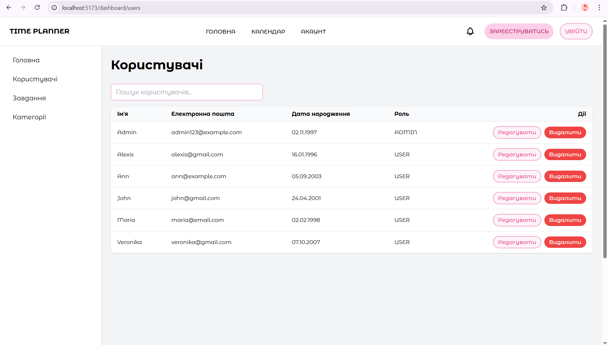
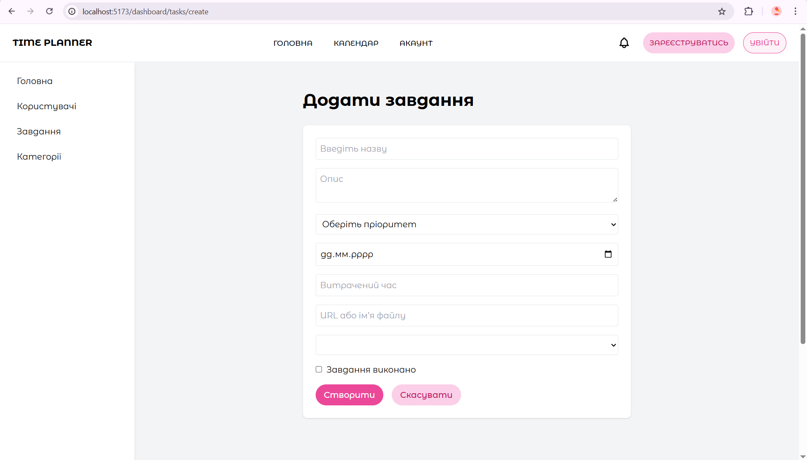
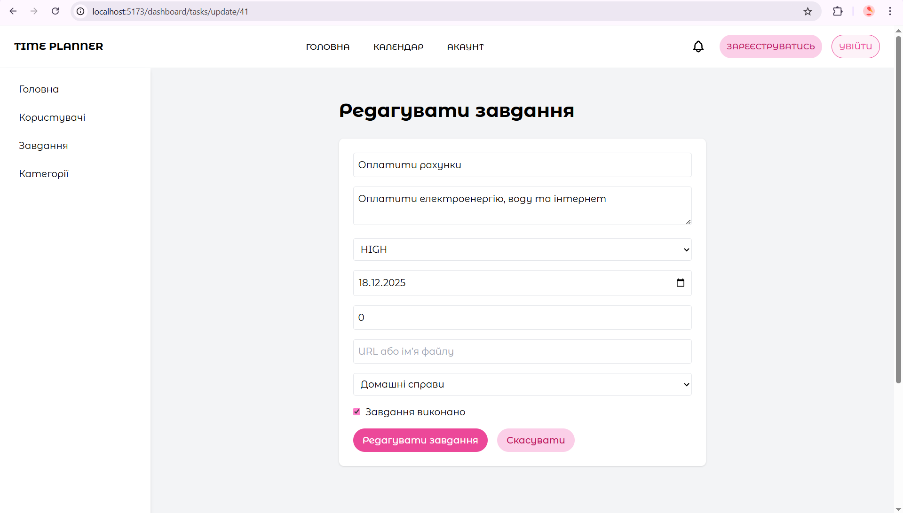

# Назва проєкту

> Повнофункціональний full-stack вебзастосунок з React + Node.js

## 🎯 Опис проєкту
Веб-застосунок для планування та управління завданнями, розроблений для підвищення продуктивності користувачів. Проєкт поєднує зручний інтерфейс та сучасні технології, що дозволяють організувати робочий час ефективно.
### Основні можливості:
- Створення, редагування та видалення основних сутностей.
- Призначення термінів, пріоритетів та категорій для завдань.
- Відображення сутностей у вигляді списку, календаря і дашборду.
- Кількість записів в основних сутностях та виконані/невиконані/прострочені/на сьогодні завдання
- Real-time оновлення через WebSocket (Socket.io) для спільної роботи та онлайн-статусів користувачів.
- Система аутентифікації та ролей (USER / ADMIN).

## ✨ Функціональність

### Backend
- ✅ RESTful API на Node.js + Express
- ✅ PostgreSQL база даних з Prisma ORM
- ✅ JWT аутентифікація
- ✅ WebSocket для real-time комунікації
- ✅ API документація (Swagger)

### Frontend
- ✅ Vue 3 + TypeScript + Vite
- ✅ Система аутентифікації
- ✅ CRUD інтерфейси для всіх сутностей
- ✅ Real-time оновлення через Socket.io-client
- ✅ Валідація форм (Vee-Validate + Zod)
- ✅ Responsive дизайн (Tailwind CSS)

## 🛠 Технології

### Backend
- Node.js 18+
- Express.js
- PostgreSQL
- Prisma ORM
- Socket.io
- JWT + bcrypt

### Frontend
- Vue 3
- TypeScript
- Vite
- Tailwind CSS
- Vue Router 4
- Axios
- Pinia
- Vee-Validate + Zod

## 📦 Встановлення та запуск

### Вимоги
- Node.js 18+
- PostgreSQL 14+
- npm або yarn

### Backend

\`\`\`bash
# Клонування репозиторію
git clone (https://github.com/veronikamaliar/TimePlannerApp.git)
cd backend

# Встановлення залежностей
npm install

# Налаштування .env
cp .env.example .env
# Встановити DATABASE_URL та інші змінні

# Міграція бази даних
npx prisma migrate dev

# Запуск сервера
npm run dev
\`\`\`

### Frontend

\`\`\`bash
cd frontend

# Встановлення залежностей
npm install

# Налаштування .env
cp .env.example .env
# Встановити VITE_API_URL=http://localhost:3000

# Запуск у режимі розробки
npm run dev
\`\`\`

## 🚀 Production Deployment

### Backend
Задеплоєно на: [Render]
URL: https://time-planner-app.onrender.com/

### Frontend
Задеплоєно на: Vercel
URL: https://myapp.vercel.app

## 📁 Структура проєкту

### Backend
\`\`\`
backend/
├── src/
│   ├── controllers/    # Бізнес-логіка
│   ├── routes/         # API маршрути
│   ├── middleware/     # Middleware функції
│   ├── services/       # Сервісний шар
│   └── utils/          # Допоміжні функції
|   └── app.js          # Головний файл запуску додатку
├── prisma/
│   └── schema.prisma   # Схема БД
├── .env                # Конфігураційні змінні середовища     
├── .gitignore          # Файли та папки, які Git ігнорує      
├── package.json        # Залежності, скрипти та метадані проекту       
├── package-lock.json   # Фіксовані версії залежностей для відтворюваності
\`\`\` 

### Frontend
\`\`\`
src/
├── assets/          # Картинки, стилі
├── components/      # Переусні UI компоненти
├── pages/           # Компоненти сторінок
├── router/          # конфігурація маршрутизації
├── services/        # API сервіси
├── styles/          # Теми
├── types/           # TypeScript типи
├── utils/           # Utility функції
├── App.vue          # Кореневий компонент
├── env.d.ts         # Оголошення модулів
├── main.ts          # Підключення router
\`\`\`

## 📸 Скріншоти

### Dashboard
[]

### CRUD інтерфейс
[]

## 🔑 Тестові облікові дані

\`\`\`
Email: admin123@example.com
Password: admin123
\`\`\`

## 📊 Продуктивність

- Lighthouse Score: 95+
- Bundle Size: < 200KB (gzipped)
- First Contentful Paint: < 1.5s
- Time to Interactive: < 3.5s

## 🔐 Безпека

- JWT токени з expiration
- Bcrypt хешування паролів
- CORS налаштування
- Input валідація на клієнті та сервері
- SQL injection захист через Prisma
- XSS захист

## 📝 API Документація

Swagger документація доступна за адресою: `/api-docs`

## 👨‍💻 Автор

**Маляр Вероніка**
- Група: ІПЗ-42
- GitHub: https://github.com/veronikamaliar/TimePlannerApp.git

